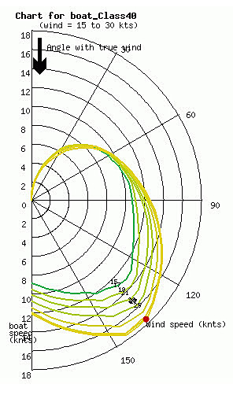
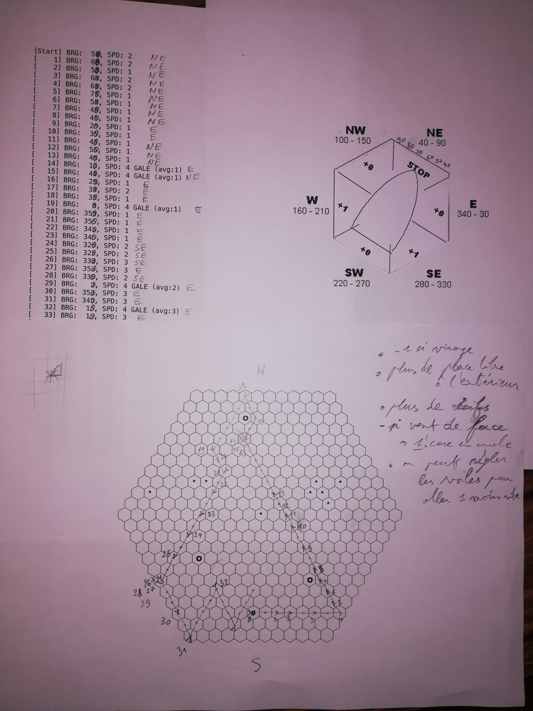

Sail Race: Carnet d'auteur
==========================

19 avril
--------

Le système de calcul de vitesse du bateau est inspiré des diagrammes polaires de vitesse:

Pour des raisons de jouabilité, la polaire est simplifiée en étant ramenée à 4 allures :

- vent arrière (vitesse moyenne),
- grand largue (le plus rapide),
- bon plein (vitesse moyenne),
- vent de face (bateau à l'arrêt).

19 avril, 17:43
---------------

([Post Facebook](https://www.facebook.com/photo?fbid=10222257038792570))

En mode brainstorming pour un nouveau jeu.

> **Résumé des commentaires**
>
> _Jeu de navigation à la voile_
>
> Gros challenge, objectifs : règles très-simples, vraies sensations de régate, tout en restant ludique ...  
> et en mode rolll-and-write.
>
> _Pavage carré ?_
>
>> J'y ai pensé mais 4 directions ne suffisent pas à rendre les sensations de la voile.
>> Idéalement il en faudrait même 8, mais les mathématiques du pavage ne sont pas d'accord 😄  
>> Pour l'instant 6 me semble un bon compromis entre fluidité et sensation.
>>
>> [Wikipédia: Pavage par polygones réguliers](https://fr.wikipedia.org/wiki/Pavage_par_des_polygones_r%C3%A9guliers)
>>
>> _Diagonales changent la vitesse ..._
>>
>> C'est justement ça le soucis, pour ce que je veux faire, les distances sont importantes.
>>
>> (Autrement dit, j'ai besoin d'un pavage isotropique 😉)

22 avril
--------

Debriefing première partie de test à 2 joueurs.

Temps: environ 15 min. (34 tours)

Sensations: on retrouve bien les trajectoires d'un voilier et l'effet du vent selon l'orientation du bateau

Points négatifs :

- [I1] Pas de réelle possibilité de se démarquer, on arrive en même temps à l'arrivée
- [I2] Les rares fois ou un choix aurait pu faire changer le résultat final,
  c'aurait été suite à un pur coup de chance
- [I3] Le jeu devient très ennuyant quand on est bloqué plusieurs tours d'affilée,
  coincé entre un vent contraire et le bord de carte.

Suggestions d'améliorations :

- Donner plus d'importance aux décisions (cf. [I1], [I2]):
    - [A11] Perte de vitesse quand on change le cap &rarr; -1
    - [A12] Placer plus de récifs sur la carte
- [A2] On peut "ralentir" son bateau (~= réglage des voiles) (cf. [I2])  
  &rarr; déplacement d'une case en moins
- [A3] Laisser plus de place libre à l'extérieur des bouées (cf. [I3])
- [A4] Rendre possible la navigation "au près" (cf. [I3])  
  &rarr; déplacement d'une seule case, en crabe,
  quand le vent est de face (babord ou tribord, à l'opposé du vent)

22 avril, 22:42
---------------

([Post Facebook, suite](https://www.facebook.com/groups/auteursdejeux/?post_id=3237059009661472&comment_id=3244587412241965))

Un retour après une première série de tests in house.

Le jeu est vraiment fluide, et retranscrit très bien le comportement d'un voilier en régate.  
Les règles sont très simples, et semblent faciles à expliquer et à appliquer.

Peut-être trop simples en fait.  
Les choix sont en général évidents, et les décisions qui font la différence peu nombreuses,
et trop souvent résolues par un coup de chance.

Au final, pas suffisamment de challenge dans l'état actuel.  
(Dernier test à 2 joueurs : on passe l'arrivée en même temps après 30 tours de jeu.)

Mais on a eu plusieurs idées d'amélioration, donc je ne désespère pas.  
Par contre, c'est pas encore assez mature pour l'infliger à grande échelle 😃  

Et dès que je trouve un peu de temps, je rédige un résumé des règles.

3 mai
-----

Les [règles](./RULES.md) ont été rédigées dans une forme préliminaire (de travail),
et le carnet d'auteur démarré (ce présent document).

Nouvelles idées d'amélioration dans la foulée du précédent débriefing :

- [A11-b] comme [A11], mais arrêt complet au prochain tour
- [A11-c] similaire à [A11-b], mais pour faciliter le déroulement :
  à chaque tour on doit choisir entre faire une manoeuvre
  _ou_ faire avancer le bateau (et [A2] n'est plus vraiment nécessaire)
- [A11-d] plus réaliste : comme [A11-c], mais un changement de cap de 60° est "gratuit"
- [A11-e] Et si on choissait le cap _après_ la détermination du vent et _avant_ le déplacement ?
  (cf. [I2], [I3]) &rarr; Moins de chance, plus de stratégie ?? (à confirmer)
- [A13] nouvelle manœuvre : sortir le spi  
   &rArr; +1 par "grand largue" (ou x2 ?)  
   &rArr; mais nouvelle manœuvre obligatoire pour le rentrer si le vent est au "bon plein" ou "de face"
