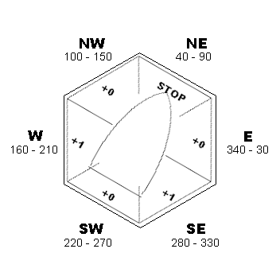

Sail Race: Règles du jeu
========================

> _Sail Race_ est un jeu de type "Roll & Write", compétitif,
> qui vise à faire vivre les sensations d'une régate à la voile.

<!-- TOC -->

- [Matériel](#matériel)
- [Déroulement](#déroulement)
    - [Départ](#départ)
        - [1. Pour déterminer la direction et la force du vent](#1-pour-déterminer-la-direction-et-la-force-du-vent)
        - [2. Pour choisir le cap initial de son voilier](#2-pour-choisir-le-cap-initial-de-son-voilier)
    - [À chaque tour](#à-chaque-tour)
        - [1. Pour modifer les conditions de vent](#1-pour-modifer-les-conditions-de-vent)
        - [2. Pour déplacer son bateau](#2-pour-déplacer-son-bateau)
        - [3. Pour ajuster le cap du bateau](#3-pour-ajuster-le-cap-du-bateau)
    - [Fin du jeu](#fin-du-jeu)
- [Historique](#historique)
    - [V0.1 (2020-04-19)](#v01-2020-04-19)

<!-- /TOC -->

| Version | 0.1 |
| -------:|:--- |
| Date    | 2020-04-19 |

Disclaimer
----------

Dans leur état actuel, la forme des règles n'a pas encore été optimisée pour
qu'elles soient compréhensibles par le plus grand nombre.
Leur rôle est essentiellement de cristalliser ma réflexion.

## Matériel
  
- pour chaque joueur:
    - _une grille hexagonale_
      ([exemple](./MAP[0].png)), figurant :
        - une position de départ et d'arrivée, représentée par le symbole "**#**"
        - des bouées (en général 3), représentées par le symbole "**O**"
        - des récifs épars, représentés par le symbole "**\***"
    - un ensemble permettant de calculer facilement la vitesse du bateau en fonction de la direction du vent:
        - _[la rose des vents](./COMPASS.png )_: un mini plateau avec une grande case hexagonale
        - _[le bateau](./BOAT.png)_: un grand jeton hexagonal représentant la "polaire de vitesse" du voilier

- commun à tous les joueurs:
    - _2 dés_ classiques, de couleurs **différentes**, à 6 faces numérotées de 1 à 6
    - _le bulletin météo_:
      une feuille (ou un tableau effaçable) sur laquelle on écrira la direction et la force du vent,
      valables pour le tour en cours  
      {TODO: prévoir un tableau avec des jetons pour ne pas devoir écrire?}
    - 2 [tables de résolution](./TABLES):
        - une table de tirage aléatoire de la direction initiale du vent
        - une table de tirage aléatoire de l'évolution du vent (direction et force)

## Déroulement

Chaque joueur va tracer le trajet de son voilier sur sa grille hexagonale.

La course suit le principe des régates :

- Tous les bateaux partent du même point (**#**).
- Ils doivent faire le tour du plateau en dépassant chaque bouée (**O**) _par l'extérieur_.
- Le premier bateau à revenir au point de départ (**#**) est déclaré vainqueur.
  _(Il n'est pas nécessaire de passer exactement sur la case de départ, traverser une des cases voisines est suffisant.)_
- Tous les bateaux doivent faire le tour dans le même sens
  (anti-horlogique s'ils passent à tribord (à droite) des bouées, ou inversément).
  En général, ce sens est choisi de sorte que les bateaux partent plus ou moins face au vent
  (direction de la première bouée).

### Départ

Avant le signal de départ :

1. on détermine la direction et la force initiales du vent,
2. chaque joueur choisit le cap de son voilier.

#### 1. Pour déterminer la direction et la force du vent

- La force initiale est: `2`.
- On détermine la direction aléatoirement:
    - il convient au préalable de décider, pour toute la durée de la partie,
      quelle couleur de dé désigne les colonnes, et quelle couleur désigne les lignes ;
    - on jete les 2 dés et on lit la direction initiale dans la [première table](./TABLES).  
      > La valeur obtenue représente l'angle _d'où vient_ le vent.
- On affiche ces valeurs sur le _bulletin météo_.

> Exemple de bulletin météo :
>
> | Force | Direction |
> |:-----:|:---------:|
> |   2   |    240    |

#### 2. Pour choisir le cap initial de son voilier

- Le joueur positionne librement son jeton "bateau" sur son plateau "rose des vents".
  Les directions possibles sont : E, NE, NW, W, SW, E

> Exemple de cap initial :
>
> 
>
>> La bateau suit un cap `NE`.
>>
>> Étant donnée la direction initiale du vent (voir ci-dessus),
>> celui-ci _vient_ de `240°` (du `SW`), c'est-à-dire de l'arrière du bateau.
>> On dit que _le voilier navigue "vent arrière"_.

### À chaque tour

1. On modifie la direction et la force du vent.
2. Chaque joueur déplace son bateau.
3. Chaque joueur ajuste le cap de son bateau.

#### 1. Pour modifer les conditions de vent

- On jete les 2 dés et on cherche la case correspondante dans la [deuxième table](./TABLES).
  On y lit 2 valeurs :
    - la _première_ valeur est la correction à apporter à la _direction_ du vent ;
    - la _deuxième_ valeur est la correction à apporter à la _force_ du vent :
        - `+` : augmenter la force du vent de 1, sans dépasser `3`
        - `-` : diminuer la force du vent de 1, sans passer en-dessous de `1`
        - `g` : coup de vent (_gale_) : le vent augmente temporairement à force `4`,
          mais reviendra à sa valeur précédente au prochain tour
- Écrire les nouvelles valeurs sur le _bulletin météo_.
  En cas de coup de vent, écrire `4` suivi de la valeur actuelle du vent entre parenthèses
  (c'est la valeur qu'il faudra reprendre en compte au prochain tou).

#### 2. Pour déplacer son bateau

- Rechercher sur _la rose des vents_, la direction _actuelle_ du vent.
- Trouver, sur _le bateau_ le modificateur à appliquer à la force du vent.
  _(À ce stade, il n'est pas autorisé de modifier le cap du bateau,
  il doit rester tel que programmé au tour précédent.)_
- Additionner ce modificateur à la force _actuelle_ du vent pour trouver la vitesse du bateau.
    - La vitesse ne descend jamais en-dessous de `0` (le bateau ne "cule" jamais).  
    {TODO: N'y avait-il pas une vitesse minimum de `1`, hors vent de face ?}
- Le bateau doit se déplacer en ligne droite suivant son cap programmé au tour précédent,
  et d'un nombre de cases correspondant à sa vitesse actuelle.
    - Si la bateau atteint une case récif, il s'arrête sur la dernière case avant le récif.  
      _(On considère que l'équipage a fait une manoeuvre d'urgence pour éviter l'accident.)_
    - Si le bateau atteint le bord de la grille, il s'arrête sur la dernière case valide.  
      _(On considère que le plan d'eau est entouré de récifs.)_
- Le joueur dessine le déplacement de son bateau sur la grille.

  > Reprenons l'exemple ci-dessus.
  >
  > 1. Le lancer de dés donne 1, 6. Cela correspond à la case "-30/g".
  >    La direction du vent passe à 210° et les bateaux subissent un coup de vent.
  >    On modifie le bulletin météo comme suit :
  >
  >    | Force | Direction |
  >    |:-----:|:---------:|
  >    | 4g(2) |    210    |
  >
  > 2. La lecture sur la rose des vents nous montre que le bateau est maintenant au "largue",
  >    et le modificateur est `+1`.
  >    Le bateau avance donc de `5` cases (4+1) en direction du `NE` (son cap actuel).
  >
  >    _Quel départ !_

#### 3. Pour ajuster le cap du bateau

- Le joueur peut ré-orienter librement son voilier dans la rose des vents.
- (Ce nouveau cap sera d'appliication pour le prochain tour.

### Fin du jeu

Dès qu'au moins un joueur repasse sur la case de départ (ou une des cases voisines),
le jeu est terminé et le(s) joueur(s) ayant terminé la course est(sont) proclamé(s) vainqueur(s).

## Historique

### V0.1 (2020-04-19)

État des règles lors du premier test
